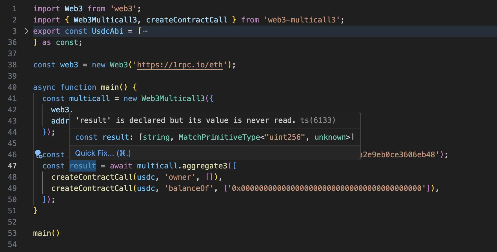

<div align="center">
<h1>Web3 Multicall3</h1>
</div>

[`Multicall3`](https://www.multicall3.com/) is a library for batching contract calls.
`Web3-multicall3` is a type-safe [`multicall3 contract`](https://github.com/mds1/multicall/blob/main/src/Multicall3.sol) wrapper



- [Installation](#installation)
- [Usage](#usage)
  - [createContractCall](#createcontractcall)
  - [Examples](#examples)
  - [Demo code](#demo)
    - [`NodeJS`](./demo/node/)
    - [`Browser`](./demo/html/)
    - [`React TypeScript`](./demo/react-ts/)
    - [`React JavaScript`](./demo/react-js/)
- [Tests](#tests)


## Installation
```
yarn add web3-multicall3
```

## Usage
```
const multicall = new Web3Multicall3({
  web3: web3Instance, // Web3 v4.*
  address: '0xcA11bde05977b3631167028862bE2a173976CA11', // constant address
});

const [someFunctionResponse] = await multicall.aggregate3([
  createContractlCall(
    contract, // some contract
    'someFunctionName', // function name, types are automatically obtained from contract
    [arg1, arg2] // someFunction parameters, types validated by web3
  )
]);
```

### createContractCall
A utility that provides type support for proper use of web3 contract

### Demo
- [`NodeJS`](./demo/node/)
- [`Browser`](./demo/html/)
- [`React TypeScript`](./demo/react-ts/)
- [`React JavaScript`](./demo/react-js/)
#### Parameters
* contract - web3.eth.contract
* fnName - function name (obtained from provided contract)
* args - arguments of selected function (types are validated)

## Examples
* [`USDC example`](./demo/node/usdc.example.ts) - fetching USDC contract owner and balance of zero address
* [`USDC example (plugin)`](./demo/node/usdc-plugin.example.ts) - Web3Multicall3Pluge usage


## Tests
* Only very base tests are implemented
